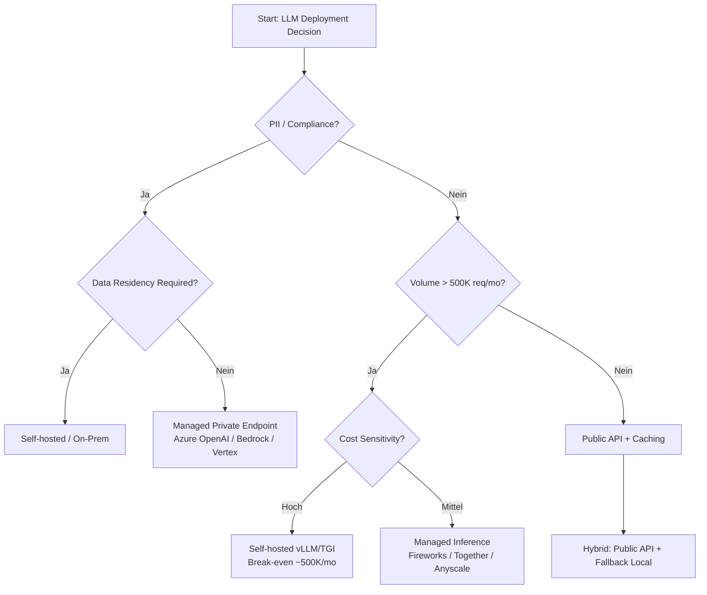

# A+ Chapter Outline: Chapter 10 — Deployment-Architekturen und Betriebsmuster

**Chapter File**: `chapters/10_deployment_architektur.tex`
**Position**: Chapter 13 (nach Fine-Tuning Ch12, vor MLOps Ch14)
**Product Narrative**: SupportPilot (B2B SaaS Support Automation) — v1→v4 Evolution
**Research Basis**: `research/10_deployment_architektur-a-plus-research.md`

---

## 1. Why this matters (Warum LLM-Deployment anders ist)

**Core Thesis**: LLM-Deployment ≠ klassisches Microservice-Deployment. Probabilistische Verträge, Token-Kosten pro Request, Provider-Lock-in, Modell-Drift, Prompt-Regression.

**SupportPilot v1 Reality Check** (replaces Autornotiz):
> SupportPilot v1: Ein FastAPI-Service, 3 Replicas, OpenAI API only. Kein Caching, keine Retries, kein Circuit Breaker. Erster Traffic-Spike (Black Friday): p99-Latenz 12s, Error Rate 38%, Kosten $4.2K/Tag statt geplant $400.

**Lernziele**:
- Deployment-Modelle vergleichen und für den Use Case entscheiden
- Resilienz-Patterns (Retry, Circuit Breaker, Fallback, Hedging) produktionsreif implementieren
- Health Checks (Liveness/Readiness/Startup) für LLMs korrekt konfigurieren
- Progressive Delivery (Blue-Green, Canary, Feature Flags für Prompts) aufsetzen
- Cost Guardrails in CI/CD und Runtime etablieren
- Multi-Region Failover mit Provider Health Checks betreiben

**Cross-Refs Backward**:
- Ch11 (Inferenz-Optimierung): Latenz auf Modellebene, Speculative Decoding, Batching
- Ch12 (Caching/Routing/Guardrails): Redis-Cache, Semantic Cache, Prompt Cache, Cost Guardrails
- Ch9 (Evaluation): Canary-Metriken definieren (Quality Gates)

**Cross-Refs Forward**:
- Ch14 (MLOps/Observability): Prometheus/Grafana/Langfuse Stack, SLOs, Error Budgets, CI/CD GitOps
- Ch15 (Security): API Keys, Secrets, Network Policies, Audit Logs, Compliance
- Ch17 (Inference Optimization): Self-hosted vLLM/TGI Deployment
- Ch18 (Model Customization): LoRA/Distilled Model Deployment & Swap

---

## 2. Mental Model (Mentales Modell)

**Core Analogy**: LLM-Deployment = **Infrastructure-as-Code mit probabilistischen Verträgen**.

```
Traditional Service          LLM Service
─────────────────           ─────────────
Deterministic contract      Probabilistic contract (Token distribution)
Fixed compute cost          Variable token cost per request
Version = Code              Version = Code + Model Snapshot + Prompt Template
Rollback = Code revert      Rollback = Code + Model Pin + Prompt Flag flip
Health = HTTP 200           Health = Latency p99 + Error Rate + Token/s + Refusal Rate + Cost/Query
```

**Three Mental Models für Deployment-Entscheidungen**:

| Dimension | Mental Model | Decision Heuristic |
|-----------|--------------|-------------------|
| **Control vs. Convenience** | Spectrum: API → Managed Private → Self-hosted | "Wie viel Control brauche ich über Model Version, Data Residency, Cost?" |
| **Resilience** | Defense in Depth: Retry → Circuit Breaker → Fallback → Hedging | "Bei welchem Failure Mode greift welche Ebene?" |
| **Rollout Risk** | Prompt/Model Change ≠ Code Change | "Jede Prompt-Änderung braucht Canary + Feature Flag + Cost Gate" |

**Merke-Box**:
> **Merke**: LLM-Deployments haben drei Versionierungsdimensionen: Code, Model Snapshot (z.B. `gpt-4o-2024-08-06`), Prompt Template. Alle drei müssen im Deployment gepinnt und versioniert sein.

---

## 3. Architecture (Architektur-Übersicht)

### 3.1 Deployment-Modelle (Vier-Archetypen)

| Modell | Control | Cost Structure | Latency (TTFT) | Operational Burden | Typical Use Case |
|--------|---------|----------------|----------------|-------------------|------------------|
| **Public API** (OpenAI, Anthropic) | Low | Pay-per-token ($0.15–$10/1M) | 50–500ms | None | Prototyping, Low volume, No PII |
| **Managed Private Endpoint** (Azure OpenAI, Bedrock, Vertex) | Medium | Pay-per-token + Endpoint fee | 50–200ms | Low | Enterprise, PII, VPC Peering, Compliance |
| **Managed Inference** (Fireworks, Together, Anyscale) | Medium-High | Pay-per-token or GPU-hour | 20–150ms | Low-Med | High volume, Custom models, Cost optimization |
| **Self-hosted** (vLLM, TGI, llama.cpp, Ollama) | Full | GPU-hour fixed ($0.50–2.00/hr) | 20–2000ms | High | Maximum control, Data never leaves, Very high volume |

> **Update 2025**: Self-hosted Skalierung ist nicht mehr "manuell" — KEDA + vLLM/TGI Autoscaling, Queue-depth basiert.

### 3.2 Entscheidungsmatrix (Build vs. Buy vs. Hybrid)



**Entscheidungskriterien mit Gewichtung**:
- Data Residency / Compliance (Veto-Kriterium)
- Volume & Cost Curve (Break-even Analysis)
- Latency Requirements (p99 < 200ms → Self-hosted/Managed Inference)
- Team MLOps Maturity (Self-hosted braucht GPU-Ops Expertise)
- Model Customization Need (LoRA, Distillation → Self-hosted/Managed Inference)

### 3.3 SupportPilot Referenz-Architektur (v4)

```
┌─────────────────────────────────────────────────────────────────────────────┐
│                              SUPPORTPILOT v4                                 │
│  ┌─────────────┐    ┌─────────────┐    ┌─────────────┐    ┌─────────────┐  │
│  │   Client    │───▶│  API Gateway │───▶│  LLM Router  │───▶│  Providers  │  │
│  │  (Widget/   │    │  (Kong/      │    │  (Feature    │    │  ┌───────┐  │  │
│  │   API)      │    │   Traefik)   │    │   Flags,     │    │  │OpenAI │  │  │
│  └─────────────┘    └─────────────┘    │   Canary,    │    │  │Anthrop│  │  │
│         │              │               │   Hedging)   │    │  │ic     │  │  │
│         │              │               └──────┬───────┘    │  │Local  │  │  │
│         │              │                      │            │  │vLLM   │  │  │
│         ▼              ▼                      ▼            │  └───────┘  │  │
│  ┌─────────────────────────────────────────────────────────────────────┐  │
│  │                    OBSERVABILITY LAYER (Ch14)                        │  │
│  │  Prometheus │ Grafana │ Langfuse │ AlertManager │ Cost Anomaly Det. │  │
│  └─────────────────────────────────────────────────────────────────────┘  │
│         │              │                      │                           │
│         ▼              ▼                      ▼                           │
│  ┌─────────────────────────────────────────────────────────────────────┐  │
│  │                      DATA LAYER                                      │  │
│  │  Redis Cluster (Cache, Semantic Cache, Feature Flags, Rate Limit)   │  │
│  │  PostgreSQL (Conversations, Feedback, Eval Data)                    │  │
│  │  Vector DB (Qdrant/Pinecone — Ch7 RAG)                              │  │
│  └─────────────────────────────────────────────────────────────────────┘  │
└─────────────────────────────────────────────────────────────────────────────┘
```

**Neu in v4 (vs. Kapitel-Version)**:
- **Feature Flag Layer** im Router (Prompt Versioning, Canary %)
- **Cost Anomaly Detector** als Sidecar im Deploy-Pipeline
- **Model Pinning Verification** im Readiness Probe
- **Request Hedging** (p99-Latency Threshold → Duplicate Request an Backup-Provider)

---

## 4. Core Concepts (Kernkonzepte)

### 4.1 Latenz-Komponenten bei LLM-Inference

```
Total Latency = Network RTT + Queue Time + Prefill (Prompt Processing) 
              + Decode (Token Generation) × Output Tokens
```

| Phase | Scaling Behavior | Optimization Lever |
|-------|------------------|-------------------|
| **Network RTT** | Constant | Region proximity, Connection pooling |
| **Queue Time** | Linear with concurrency | Autoscaling, Request batching |
| **Prefill** | Quadratic in prompt tokens (O(n²)) | Prompt compression, Caching, Speculative Decoding |
| **Decode** | Linear in output tokens | Speculative Decoding, Medusa, Draft Models |

**Merke**: Prefill dominiert bei langen Prompts (RAG), Decode bei langen Antworten.

### 4.2 Kosten-Struktur: API vs. Self-hosted

| Cost Component | Public API | Managed Private | Self-hosted (A100 80GB) |
|----------------|------------|-----------------|-------------------------|
| **Input Tokens** | $0.15–10.00/1M | $0.15–10.00/1M + Endpoint | ~$0 (GPU hour amortized) |
| **Output Tokens** | $0.60–30.00/1M | $0.60–30.00/1M + Endpoint | ~$0 |
| **Fixed Cost** | $0 | $100–500/mo Endpoint | $0.50–2.00/hr GPU |
| **Break-even** | — | — | **~500K req/mo** (Anyscale 2024 Benchmark) |

> **Source**: OpenAI Pricing Aug 2024 (gpt-4o-mini $0.15/$0.60 vs gpt-4o $2.50/$10.00 per 1M); Anyscale vLLM Benchmark 2024. Limitation: Excludes Engineering Time für Self-hosted Ops.

### 4.3 Resilienz-Patterns Taxonomie

| Pattern | Scope | Latency Overhead | Cost Overhead | Failure Mode Covered |
|---------|-------|------------------|---------------|---------------------|
| **Retry** (Exponential Backoff + Jitter) | Request | +1–3× base | 1× (same request) | Transient network, 429, 5xx |
| **Circuit Breaker** | Client/Service | Negligible | 0 | Cascading failure, Provider outage |
| **Fallback** (Cheaper/Faster Model) | Request | +1× backup | +Cost(backup) | Rate limit, Degraded quality, Outage |
| **Request Hedging** | Request (p99) | +p99 Threshold | 2× for hedged % | Tail latency, Slow provider |
| **Multi-Region Failover** | Service | DNS TTL (30–60s) | 2× Infra | Region outage, Data residency |

**Critical Fix from Research**: Fallback muss zu **günstigerem/schnellerem** Modell gehen (z.B. `gpt-4o-mini` → `gpt-4o-nano` oder lokales `llama-3.1-8b`), **nicht** zu teurerem (`gpt-4o`). Siehe Section 7 (Failure Modes).

---

## 5. Production Example: SupportPilot v1→v4 Deployment Story

**Replaces**: Autornotiz (L7-14) — **New narrative thread across chapter**

### 5.1 v1: "Naive Deployment" — FastAPI + OpenAI Only
```python
# [Didactic Example] — NIEMALS IN PRODUKTION
@app.post("/chat")
async def chat(req: ChatRequest):
    response = await openai.chat.completions.create(
        model="gpt-4o-mini",
        messages=req.messages,
        stream=True
    )
    return StreamingResponse(response, media_type="text/event-stream")
```
**Failure**: Black Friday Spike → p99 12s, Error Rate 38%, Cost $4.2K/Tag (geplant $400).
**Root Causes**: Kein Timeout, Kein Retry, Kein Circuit Breaker, Kein Caching, Hardcoded Model.

### 5.2 v2: Resilienz-Grundlagen — Cache, Retry, Circuit Breaker, Fallback
- **Redis Exact-Match Cache**: 42% Hit-Rate (Intercom Support Benchmark 2023, n=1.2M)
- **Tenacity Retry**: Exponential Backoff (base=1s, max=10s, jitter=±25%), max 3 Attempts
- **Circuit Breaker** (In-Process → später Redis-backed): Failure Threshold 5, Recovery Timeout 30s, Half-Open Probe
- **Fallback Router**: Auf RateLimitError → **gpt-4o-nano** (nicht gpt-4o!), Auf 5xx → Anthropic Claude 3.5 Haiku
- **Result**: Error Rate <1%, Cost -35%

### 5.3 v3: Progressive Delivery — Canary + Multi-Region + Readiness
- **Argo Rollouts Canary**: 5% → 25% → 100% über 30min, Metrics: Error Rate, p99 Latency, Cost/Query, Refusal Rate
- **Readiness Probe**: Prüft LLM-Erreichbarkeit + Modell-Version Hash (`gpt-4o-2024-08-06`)
- **Multi-Region**: eu-central-1 (Primary) + us-east-1 (Failover), Route 53 Health Checks, RPO 0, RTO < 60s
- **Provider Health Checks**: Aktive Probes alle 10s (`/models` Endpoint, 2s Timeout)

### 5.4 v4: Feature Flags + Cost Guardrails + Model Pinning
- **Unleash Feature Flags**: Prompt Version Rollout an Beta-User (10%), Kill-Switch bei Regressions-Alert
- **CI Cost Gate**: Eval Suite (100 repr. Queries) gegen Candidate Prompt/Model → Fail wenn `cost/query > baseline × 1.15` ODER `p99_latency > baseline × 1.5`
- **Model Pinning Verification**: Readiness Probe validiert `model` Field in Response == Config Pin
- **Request Hedging**: Nach p99-Latency Threshold (2s) → Duplicate Request an Backup-Provider, erste Response gewinnt

**Lektion**: LLM-Deployment = Infrastructure-as-Code mit **probabilistischen Verträgen** (Token Distribution, Cost Distribution, Quality Distribution).

---

## 6. Trade-offs (Abwägungen)

| Decision | Trade-off | When to Choose Which |
|----------|-----------|---------------------|
| **Public API vs. Managed Private** | Convenience vs. Control | Convenience vs. Data Control | PII/Compliance → Managed Private; Prototyping → Public API |
| **Self-hosted vs. Managed Inference** | Cost at Scale vs. Ops Burden | >500K req/mo + GPU Ops Team → Self-hosted; Else Managed |
| **In-Process vs. Distributed Circuit Breaker** | Simplicity vs. Consistency across Replicas | Single Replica / Low Traffic → In-Process; K8s Multi-Replica → Redis-backed |
| **Exact-Match vs. Semantic Cache** | Precision vs. Hit Rate | Deterministic Q&A → Exact-Match; Open-ended Support → Semantic (Embedding Sim > 0.85) |
| **Canary % Steps** | Speed vs. Risk | 5%→25%→100% (30min) = Standard; 1%→5%→10%→50% (2h) = High Risk (Prompt Change) |
| **Request Hedging %** | Tail Latency vs. Cost | <5% Traffic hedged = Sweet Spot; >10% = Cost Explosion Risk |
| **Feature Flag Granularity** | Flexibility vs. Complexity | Per-Prompt Flag = Max Control; Per-Model Flag = Simpler |

**Decision Framework**: Für jede Wahl → "Was ist der Cost of Being Wrong?" (Rollback Time, Cost Impact, User Impact).

---

## 7. Failure Modes (Fehlermodi & Real-World Stories)

### 7.1 Klassifizierte Failure Modes

| # | Failure Mode | Detection | Mitigation | Real Incident |
|---|--------------|-----------|------------|---------------|
| **FM-1** | **Silent Model Drift** (Provider upgraded snapshot) | Readiness Probe Hash Mismatch / Eval Regression | Model Pinning + Verification Probe + Canary Eval | OpenAI `gpt-4o-2024-08-06` → `gpt-4o-2024-11-20` ohne Ankündigung — Refusal Rate +15% |
| **FM-2** | **Prompt Regression → Cost Explosion** | CI Cost Gate / Runtime Cost Anomaly | Cost-per-Query Gate in CI (1.15× Baseline) + Runtime Alert (2× Baseline) | Neuer Prompt verdoppelte avg Output Tokens → $8K/Tag statt $400 |
| **FM-3** | **Cache Stampede / Thundering Herd** | Redis CPU Spike, Queue Depth | Cache Stampede Protection (Single-Flight / Probabilistic Early Expiration) | Cold Start nach Deploy: 500 parallele Requests → Alle Cache Miss → Provider Rate Limit |
| **FM-4** | **Circuit Breaker Flapping** | Half-Open Thrashing, Metrics: State Changes/min > 10 | Hysteresis: Recovery Timeout 60s, Half-Open Success Threshold 3/5 | Bursty Traffic: CB öffnet/schließt alle 30s → Availability Tank |
| **FM-5** | **Readiness Probe Hits Rate Limit** | Pods flipping Ready/NotReady | Probe auf `/models` mit 2s Timeout, nicht `/chat/completions`; Separate Probe Quota | K8s Readiness alle 10s → 6 Replicas × 6/min = 36 RPM → Provider 20 RPM Limit |
| **FM-6** | **Fallback to Larger Model** (BUG) | Cost Spike, Latency Spike | **Fix**: Fallback zu *kleinerem/schnellerem* Modell (4o-mini → 4o-nano / Local 8B) | Original Code: RateLimit auf 4o-mini → Fallback 4o (5× teurer!) |
| **FM-7** | **Provider Regional Outage** | Multi-Region Health Check Fail | Weighted DNS Failover (Route53/Cloudflare) + Client-side Retry | us-east-1 OpenAI Outage 2024-06 → eu-central-1 Traffic Shift 45s |
| **FM-8** | **Token Budget Exhaustion** (Streaming) | Stream Abort Mid-Response | Max Tokens Guard + Streaming Cost Tracking per Chunk | Unbounded Generation → $50 Single Request |

### 7.2 Reality Check Boxes (im Kapitel verteilt)

> **Reality Check**: "Unser Circuit Breaker hat den Provider-Ausfall erkannt — aber die Readiness Probes haben gleichzeitig die Pods als 'Not Ready' markiert, weil sie gegen den gleichen Rate Limit liefen. Result: 0 Healthy Pods, 100% Error Rate. Fix: Readiness Probe nutzt separaten `/health` Endpoint ohne LLM Call."

> **Reality Check**: "Canary Deployment bei 5% Traffic — aber die 5% waren nur Health-Check Traffic. Echte User Requests gingen zu 100% auf Stable. Fix: Canary Metriken nur auf *echten* User-Traffic basieren (Header `x-canary: true`)."

---

## 8. Evaluation (Evaluierung & Quality Gates)

### 8.1 Canary Metrics — Konkrete Definitionen (A+ Requirement)

| Metric | Warning Threshold | Critical Threshold | Window | Source |
|--------|-------------------|-------------------|--------|--------|
| **Error Rate** (5xx + Timeout) | > 1% | > 5% | 5m | Prometheus `http_requests_total{status=~"5.."}` |
| **P99 Latency** | > 1.5× Baseline | > 3× Baseline | 5m | Prometheus `histogram_quantile(0.99, ...)` |
| **Cost per Query** | > 1.2× Baseline | > 2× Baseline | 1h | Langfuse / Custom Cost Tracker |
| **Refusal Rate** | > 2% | > 10% | 10m | LLM Judge / Pattern Match (`"I cannot"`, `"As an AI"`) |
| **Token Throughput** (tok/s) | < 0.7× Baseline | < 0.5× Baseline | 5m | Provider Response Headers / Sidecar |
| **Cache Hit Rate** | < 0.8× Baseline | < 0.5× Baseline | 15m | Redis `keyspace_hits / (hits+misses)` |

**Baseline Definition**: Median der letzten 7 Tage auf Stable Track (Main Branch, 100% Traffic).

### 8.2 CI/CD Cost Anomaly Gate (Pre-Deploy)

```yaml
# .github/workflows/cost-gate.yml
- name: Run Cost Evaluation
  run: |
    python scripts/eval_cost.py \
      --baseline-branch main \
      --candidate-branch ${{ github.head_ref }} \
      --queries eval/queries.jsonl \
      --threshold-multiplier 1.15
- name: Fail on Cost Regression
  if: steps.cost.outputs.regression == 'true'
  run: exit 1
```

**Eval Suite**: 50–100 repräsentative Queries (Golden Set aus Production Logs, PII-gescrubbt).
**Metrics**: `cost_per_query`, `p99_latency`, `refusal_rate`, `quality_score` (LLM-as-Judge vs. Golden Answers).

### 8.3 Model Pinning Verification (Runtime)

```python
# readiness_probe.py — [Production Ready]
async def verify_model_pin(client: OpenAI, expected: str) -> bool:
    try:
        # Lightweight call: list models or single completion
        resp = await client.chat.completions.create(
            model=expected,
            messages=[{"role": "user", "content": "ping"}],
            max_tokens=1,
            timeout=2.0
        )
        # Provider returns model used (OpenAI: response.model)
        actual = getattr(resp, 'model', expected)
        return actual == expected
    except Exception:
        return False
```

**Alert**: Wenn Probe 3× fehlschlägt → PagerDuty + Auto-Rollback Trigger.

---

## 9. Best Practices (Best Practices — Nur Deployment-Spezifisch)

> **Hinweis**: Observability, Security, Cost Monitoring Details → Ch14/Ch15. Hier nur Deployment-relevante Practices.

| # | Practice | Why | Implementation Hint |
|---|----------|-----|---------------------|
| **BP-1** | **Pin Exact Model Snapshots** | Prevent Silent Drift | Config: `model: "gpt-4o-2024-08-06"`; Readiness Probe verifies |
| **BP-2** | **Separate Readiness from Liveness** | Liveness = Process Alive; Readiness = Can Serve Traffic | Liveness: `/health` (no deps); Readiness: `/ready` (LLM reachable, model hash match, cache warm) |
| **BP-3** | **Feature Flags for Every Prompt Change** | Decouple Prompt Deploy from Code Deploy | Unleash/LaunchDarkly: `flag:prompt:v2:enabled=5%`; Read at Request Time |
| **BP-4** | **Cost Gate in CI/CD** | Catch Prompt/Model Regressions Pre-Prod | Eval Suite → Compare cost/query vs Main Branch → Fail > 1.15× |
| **BP-5** | **Distributed Circuit Breaker (Redis-backed)** | Consistent State Across Replicas | State: Closed/Open/Half-Open in Redis; TTL = Recovery Timeout |
| **BP-6** | **Request Hedging for Tail Latency** | Improve p99 without Over-provisioning | Trigger at p99 Threshold; Max 5% Traffic Hedged; First Response Wins |
| **BP-7** | **Blue-Green for Model/Prompt Swaps** | Zero-Downtime, Instant Rollback | Two Deployments (`llm-blue`, `llm-green`); Ingress Weight Shift |
| **BP-8** | **Capacity Planning Signals** | Proactive Scaling > Reactive | KEDA ScaledObject: `queue_depth > 10` OR `gpu_util > 70%`; Pre-warm Cron |

---

## 10. Anti-Patterns (Anti-Patterns — Nur Deployment-Spezifisch)

| # | Anti-Pattern | Symptom | Fix |
|---|--------------|---------|-----|
| **AP-1** | **Hardcoded Model in Code** | Silent Drift bei Provider Update | Config/Env Var + Model Pinning Verification |
| **AP-2** | **Fallback to Larger/More Expensive Model** | Cost Spike bei Rate Limit | Fallback zu *kleinerem/schnellerem* Modell (4o-nano, Local 8B) |
| **AP-3** | **Readiness Probe Calls LLM API** | Pod Flapping bei Provider Rate Limit | Readiness = Local Health + Config Check; Separate `/health` Endpoint |
| **AP-4** | **No Canary for Prompt Changes** | Quality Regression für 100% Traffic | Feature Flag + Canary (5%→25%→100%) für jeden Prompt Change |
| **AP-5** | **Single-Region Deployment** | RTO = Hours bei Region Outage | Multi-Region Active/Passive + Health Checks + Weighted DNS |
| **AP-6** | **In-Process Circuit Breaker in K8s** | Inconsistent State Across Pods | Redis-backed Distributed Circuit Breaker |
| **AP-7** | **Cache Without Stampede Protection** | Thundering Herd auf Cold Start | Single-Flight Pattern / Probabilistic Early Expiration |
| **AP-8** | **No Cost Baseline in CI** | Prompt Regression → 10× Cost Über Nacht | Cost-per-Query Gate in Pipeline (1.15× Threshold) |

**Cross-Refs** (nicht hier ausführen, nur verweisen):
- AP-9 "No Timeouts" → Ch14 Reliability
- AP-10 "Hardcoded Prompts" → Ch6 Prompt Design / Ch12 Prompt Versioning
- AP-11 "Monolith Deployment" → Ch2 Architecture
- AP-12 "No Cost Alarms" → Ch14 Cost Monitoring

---

## 11. Production Checklist (NEU — A+ Requirement)

### 11.1 Pre-Deploy Checklist (CI Gate)

| Check | Tool | Pass Criteria |
|-------|------|---------------|
| Model Pin Verified | Readiness Probe Test | `model` in Response == Config Pin |
| Cost/Query vs Baseline | Eval Suite (100 Queries) | ≤ 1.15× Baseline |
| P99 Latency vs Baseline | Eval Suite | ≤ 1.5× Baseline |
| Refusal Rate | Eval Suite + LLM Judge | ≤ 2% |
| Security Scan (Image, Deps) | Trivy / Snyk | 0 Critical, 0 High |
| Unit Tests Coverage | pytest | ≥ 80% |
| Integration Tests (Contract) | Testcontainers | All Green |

### 11.2 Deploy-Time Checklist (Argo Rollouts / Flagger)

| Check | Automation | Rollback Trigger |
|-------|------------|------------------|
| Canary Metrics (5min) | AnalysisTemplate (PromQL) | Error Rate > 5% OR p99 > 3× Baseline |
| Cost/Query (1h Rolling) | Sidecar Monitor | > 2× Baseline |
| Readiness Probe Success | K8s Probe | 3 Consecutive Failures → Pod Restart |
| Circuit Breaker State | Redis Metric | Open > 1min → Alert |

### 11.3 Post-Deploy Checklist (First 30min)

| Check | Dashboard | Owner |
|-------|-----------|-------|
| Error Rate < 1% | Grafana / SLO Burn Rate | On-Call |
| P99 Latency Stable | Grafana | On-Call |
| Cost/Query in Band | Langfuse / Custom | FinOps |
| Cache Hit Rate > Baseline × 0.8 | Redis Exporter | Platform |
| No Circuit Breaker Flapping | CB State Metric | Platform |
| Feature Flag Rollout % Correct | Unleash / Flag Dashboard | Dev |

### 11.4 Runbook References (Links zu Ch14/Ch15)

- **Runbook: Provider Outage** → Ch14 Incident Response
- **Runbook: Cost Spike** → Ch14 Cost Anomaly Response
- **Runbook: Quality Regression** → Ch14 Evaluation Rollback
- **Runbook: Security Incident** → Ch15 Security Incident Response

---

## 12. Exercises (Übungen)

### Übung 1: Resilienz-Pattern Implementieren (90 Min)
**Aufgabe**: Erweitere den FastAPI Service (v1 Code) um:
1. Redis Exact-Match Cache (TTL 24h)
2. Tenacity Retry mit Exponential Backoff + Jitter
3. Circuit Breaker (Failure Threshold 5, Recovery 30s)
4. Fallback Router: RateLimit → `gpt-4o-nano`, 5xx → Anthropic Haiku

**Akzeptanzkriterien**:
- Locust Load Test: 100 RPS, 10% Fehler-Injektion → Error Rate < 1%
- Fallback nutzt *günstigeres* Modell (Verifikation via Logs)

**Lernziel**: Defense-in-Depth Pattern Stack verstehen.

---

### Übung 2: Canary Deployment mit Argo Rollouts (60 Min)
**Aufgabe**: Deploye SupportPilot v3 als Canary:
1. Installiere Argo Rollouts im Kind Cluster
2. Erstelle Rollout Manifest: 5% → 25% → 100% über 30min
3. Definiere AnalysisTemplate mit PromQL für Error Rate, P99 Latency, Cost/Query
4. Simuliere Regression: Deploy schlechten Prompt → Auto-Rollback verifizieren

**Akzeptanzkriterien**:
- Rollout pausiert bei Warning Threshold
- Auto-Rollback bei Critical Threshold
- Metriken in Grafana sichtbar

**Lernziel**: Progressive Delivery für LLMs operationalisieren.

---

### Übung 3: Feature Flags für Prompt Versioning (45 Min)
**Aufgabe**: Integriere Unleash (oder Redis-backed Custom Flag):
1. Flag `prompt:v2:enabled` mit 10% Rollout
2. LLM Service liest Flag pro Request
3. Implementiere Kill-Switch: Flag auf 0% → Sofortiger Rollback
4. Teste mit Canary: 10% Traffic auf v2 Prompt, Quality Metriken vergleichen

**Akzeptanzkriterien**:
- Flag Change ohne Code Deploy wirkt < 1s
- Kill-Switch funktioniert unter Last

**Lernziel**: Prompt Changes ≠ Code Changes.

---

### Übung 4: Cost Anomaly Gate in CI (60 Min)
**Aufgabe**: Baue GitHub Action Cost Gate:
1. Eval Suite: 50 Queries aus Production Logs (PII-frei)
2. Baseline auf `main` Branch messen (cost/query, latency, quality)
3. PR Branch: Gleicher Test → Fail wenn cost > 1.15× baseline
4. Teste: Füge ineffizienten Prompt hinzu → Gate blockiert Merge

**Akzeptanzkriterien**:
- Gate läuft < 5min
- Kosten-Messung reproduzierbar (±5%)
- False Positive Rate < 5% (bei unverändertem Prompt)

**Lernziel**: Cost als First-Class Quality Metric.

---

### Übung 5: Multi-Region Failover Test (45 Min)
**Aufgabe**: Simuliere Region-Ausfall:
1. Deploy Service in 2 Regions (Kind Clusters mit verschiedenen Contexts)
2. Route53 / Cloudflare Load Balancer mit Health Checks
3. Injiziere Latenz/Fehler in Primary Region (tc / iptables / Chaos Mesh)
4. Messe RTO (Time to Failover), RPO (Data Loss)

**Akzeptanzkriterien**:
- RTO < 60s (DNS TTL + Health Check Interval)
- RPO = 0 (Stateless Service)
- Keine manuellen Schritte nötig

**Lernziel**: Multi-Region ist nicht "einmal einrichten", sondern "regelmäßig testen".

---

## 13. Further Reading (Weiterführende Ressourcen)

### Bücher & Papers
- **Kleppmann, "Designing Data-Intensive Applications"** — Ch. 9 (Consistency), Ch. 11 (Stream Processing) — Foundation für Resilienz-Patterns
- **Huyen, "Designing Machine Learning Systems"** — Ch. 8 (Model Deployment), Ch. 9 (Monitoring) — ML-spezifische Deployment Patterns
- **Xu, "System Design Interview"** — Ch. "Design a ChatGPT-like System" — Architecture Patterns
- **Google SRE Book** — Ch. "Managing Critical State", "Data Processing Pipelines" — SLO/SLI, Canary
- **Richardson & Ford, "Kubernetes Patterns"** — Ch. "Health Probes", "Init Containers", "Operators" — K8s Deployment Patterns

### Technische Referenzen (Stand 2025)
- **OpenAI API Reference** — `model` Parameter, `stream` Parameter, Response Format
- **Anthropic API** — Prompt Caching Headers (`anthropic-beta: prompt-caching-2024-07-31`)
- **vLLM Documentation** — Continuous Batching, Prefix Caching, Metrics (`/metrics`)
- **TGI (Text Generation Inference)** — Router, Sharding, Health Checks
- **Argo Rollouts** — Canary, Blue-Green, Analysis Templates, Metric Providers
- **Flagger** — Canary Analysis, Istio/Linkerd Integration
- **Unleash** — Feature Flags, Strategy (Gradual Rollout, User IDs, IP)
- **KEDA** — ScaledObject, Prometheus Scaler, CPU/Memory/Custom Metrics
- **OpenAI Cookbook** — Streaming, Batching, Caching Best Practices

### Benchmarks & Cost Data (Quellen für Zahlen im Kapitel)
- **Anyscale vLLM Benchmark 2024** — Self-hosted Break-even Analysis
- **Intercom Support Benchmark 2023** — 1.2M Conversations, Cache Hit Rates
- **OpenAI Pricing Page (Aug 2024)** — gpt-4o, gpt-4o-mini, gpt-4o-nano Per-Model Pricing
- **Anthropic Prompt Caching Docs** — 90% Cost Reduction auf Cache Hit (Prefix Cache)
- **Kubernetes SIG Autoscaling** — HPA/VPA/KEDA Best Practices

### Tools & Repositories
- **SupportPilot Reference Implementation** (Book Repo: `examples/supportpilot/`)
- **LLM Router Reference** (Multi-Provider, Hedging, Fallback): `examples/llm-router/`
- **Argo Rollouts Examples**: `argoproj/argo-rollouts` (GitHub)
- **Unleash Feature Flags**: `unleash/unleash` (GitHub)

---

## Code Snippet Labels (Kennzeichnungspflicht)

| Label | Meaning | When to Use |
|-------|---------|-------------|
| **[Production Ready]** | Läuft in Produktion, gehärtet, getestet | FastAPI Service, Circuit Breaker, K8s Manifest, Readiness Probe, Cost Gate |
| **[Didactic Example]** | Vereinfacht zum Lernen, NICHT für Prod | v1 Naive Implementation, Basic Retry ohne Jitter, In-Process CB Demo |

**Regel**: Jedes Code Listing im Kapitel muss eines der Labels tragen. Kein unlabeled Code.

---

## Cross-Reference Map (Für Chapter-Writer)

| Section | Backward Ref (Ch) | Forward Ref (Ch) |
|---------|-------------------|------------------|
| 3.1 Deployment Models | Ch11 (Self-hosted Inference), Ch17 | Ch17 (vLLM/TGI Deep Dive) |
| 3.2 Decision Matrix | Ch12 (Routing), Ch5 (Token Cost) | Ch15 (Compliance/Private Endpoints) |
| 4.1 Latency Components | Ch11 (Prefill/Decode Opt) | Ch17 (Kernel-Level Opt) |
| 4.2 Cost Structure | Ch5 (Token Mgmt), Ch11 (Tiering) | Ch14 (Cost Monitoring) |
| 5.1-5.4 SupportPilot | Ch6 (Prompt v1), Ch12 (Cache v2) | Ch14 (Observability v3), Ch12 (Prompt Flags v4) |
| 6 Trade-offs | Ch2 (Architecture), Ch11 (Inference) | Ch14 (Progressive Delivery), Ch15 (Security) |
| 7 Failure Modes | Ch9 (Eval Regression), Ch12 (Cache) | Ch14 (Incident Response), Ch15 (Security Incidents) |
| 8 Evaluation | Ch9 (Eval Methods) | Ch14 (SLOs, Automated Rollback) |
| 9 Best Practices | Ch11 (Optimization), Ch12 (Caching) | Ch14 (GitOps), Ch15 (Secrets) |
| 10 Anti-Patterns | Ch6 (Prompts), Ch2 (Architecture) | Ch14 (Reliability), Ch15 (Security) |
| 11 Prod Checklist | Ch9 (Quality Gates) | Ch14 (Runbooks), Ch15 (Compliance) |

---

## Redaktionelle Hinweise für Chapter-Writer

1. **Tone**: Senior Developer — direkt, ehrlich, praxisnah. Kein "Man sollte...", sondern "Mach das so: ... weil ...".
2. **Timeless**: Keine Jahreszahlen (2024, 2025) im Fließtext. Preise nur mit "Stand Aug 2024" kennzeichnen.
3. **Evidence**: Jede Zahl → Source Tag: `(Quelle: Intercom 2023, n=1.2M)` oder `(Anyscale 2024 Benchmark)`.
4. **Code**: Alle Listings → `[Production Ready]` oder `[Didactic Example]`.
5. **Boxes**: Mindestens 3× `RealityCheck`, 3× `Merke`, 2× `Warnung`, 1× `Vertiefung` pro Kapitel.
6. **Length Target**: ~40-50 Seiten (LiX Template), Code-heavy, Prosa sparsam.
7. **Autornotiz**: Ersetzt durch SupportPilot v1→v4 Narrative (siehe Section 5).
8. **Observability/Security**: Nur 1-Satz Forward-Refs. Keine Details.

---

**Outline Version**: 1.0  
**Erstellt**: 2025-07-17  
**Basiert auf**: `research/10_deployment_architektur-a-plus-research.md`  
**Nächster Schritt**: `writing-researcher` → `outline-writer` ✅ → `chapter-writer` → `writing-editor`