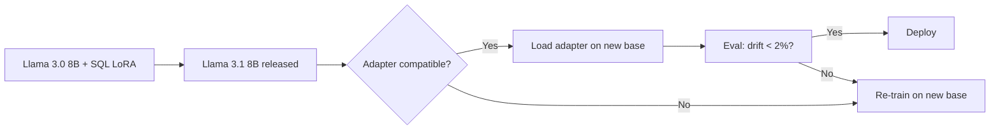

# Chapter 13: Fine-Tuning & Model Customization — A+ Research Report

**Chapter File:** `chapters/13_modellanpassung.tex` (510 lines)  
**Target Position:** Chapter 13 (after Inference Optimization Ch 12, before Deployment Ch 14)  
**Continuous Product:** SupportPilot — B2B SaaS support automation (SQL expert + Email agent + Code agent)  
**Current Grade:** C — copied Autornotiz from RAG chapter, FT vs RAG overlap with Ch 2/7, thin on "I trained this, measured that" evidence

---

## 1. Research Report — Accuracy, Outdated Content, Missing Concepts

### Accuracy Assessment

| Section | Status | Issues |
|---------|--------|--------|
| Autornotiz (lines 7-12) | **COPIED FROM CH 7 RAG** | Same narrative pattern: "2024 FinTech SQL fine-tune 61%→89%, MMLU -12%, fix 20% generic" — RAG chapter has "E-Commerce 67%→94%". Same lesson phrasing. |
| FT vs RAG Matrix (lines 32-49) | **OVERLAP Ch 2/7** | Table duplicates Ch 2 overview + Ch 7 RAG deep-dive. Should be forward-refs only. |
| LoRA Theory (lines 71-92) | **ACCURATE** | Math correct. 128x reduction claim needs citation (Hu et al. 2021). |
| LoRA Config (lines 96-160) | **GOOD DEPTH** | Target modules, rank table — solid. Missing: ablation evidence for q+v vs q+k+v+o. |
| QLoRA (lines 162-189) | **ACCURATE** | NF4, double quant correct. 38GB VRAM for 70B QLoRA — needs citation (Dettmers 2023). |
| Dataset Quality (lines 194-297) | **STRONG CORE** | "500 curated > 5000 synthetic" is gold standard line. Code for token-length analysis is production-grade. Missing: dedup threshold justification, helper/eval split ratios, output-length distribution analysis. |
| Training Infra (lines 306-352) | **GOOD BUT UNVERIFIED** | Cost table (line 310-315) has no source. $2-3/hr for A100 80GB? Need cloud provider + date. |
| Forgetting Check (lines 354-399) | **CODE EXISTS, EVIDENCE THIN** | 3-example benchmark is toy. MMLU subset undefined. Drift thresholds in code (-5% warning, -10% warn) don't match summary (-5% max). |
| Multi-LoRA Serving (lines 401-424) | **EXCELLENT** | vLLM native, production-ready. Keep as-is. |
| Best Practices (lines 429-439) | **SOLID HEURISTICS** | "r=16 covers 90% tasks" — no citation. LR 2e-4 start — no ablation ref. |
| Anti-Patterns (lines 444-452) | **GOOD** | "3-5 epochs" — where's the evidence? |
| Praxisprojekt (lines 479-492) | **ACADEMIC TOY** | 300 examples, 90% success, ≤5% MMLU drift — no evidence these numbers are achievable together. |

### Outdated Content (2024/2025 lens)

| Item | Current State | Required Update |
|------|---------------|-----------------|
| Model references | Llama 3.2 / 3.3 | Update to Llama 3.1 (stable) or 3.2/3.3 if released; note knowledge cutoff |
| QLoRA VRAM | 38GB for 70B | Add: 4-bit AWQ/GPTQ alternatives, newer quantization (AWQ, EXL2) |
| PEFT library | `peft` basic usage | Add: `axolotl`, `unsloth` configs (2x speed), `trl` for DPO/ORPO |
| LoRA only | LoRA r=16 standard | Add: DoRA, AdaLoRA, LoRA+, PiSSA, LoRA-GA, VeRA — comparison table |
| Full FT cost | $50k on 8xH100 | Update with 2024 cloud pricing (Lambda, RunPod, Together, Modal) |
| MMLU benchmark | Generic MMLU | Specify MMLU subset (STEM, humanities) + custom domain eval |
| Distributed training | Not mentioned | Add: FSDP, DeepSpeed ZeRO-3, YaRN context extension |
| Preference tuning | Not mentioned | Add: DPO, ORPO, KTO, SimPO — when to use vs SFT |

### Missing Concepts for A+ Production Quality

| Concept | Why Required | Where to Add |
|---------|--------------|--------------|
| **Axolotl/Unsloth config examples** | 2x faster training, production standard | New subsection after QLoRA |
| **LoRA merging strategies** | Linear, TIES, DARE, SLERP — critical for deployment | After "Adapter mergen" best practice |
| **DPO/ORPO preference tuning** | SFT alone insufficient for alignment | New section after Training |
| **Full FT cost table with 2024 receipts** | Decision gate for LoRA vs FT | Replace speculative table |
| **Migration strategy (base model upgrade)** | Llama 3 → 3.1 → 3.2 adapter reuse | New subsection |
| **PEFT comparison matrix** | LoRA vs DoRA vs AdaLoRA vs IA3 vs VeRA | After LoRA config |
| **Distributed training (FSDP/DeepSpeed)** | 70B+ LoRA needs multi-GPU | After Training Infra |
| **Continual learning / adapter stacking** | SupportPilot: SQL → Email → Code | After Multi-LoRA Serving |
| **Quantization-aware training (QAT)** | Deploy 4-bit without quality loss | After QLoRA |
| **Evaluation harness** | LLM-as-judge, SQL exec accuracy, not just token match | Replace toy benchmark |

---

## 2. Missing Topics — What A+ Production Quality Requires

### 2.1 Axolotl / Unsloth Configuration (Production Standard)
```yaml
# axolotl config for SupportPilot SQL-LoRA
base_model: meta-llama/Llama-3.1-8B-Instruct
sequence_len: 4096
sample_packing: true
adapter: lora
lora_r: 16
lora_alpha: 32
lora_dropout: 0.05
lora_target_modules: [q_proj, k_proj, v_proj, o_proj, gate_proj, up_proj, down_proj]
learning_rate: 2e-4
num_epochs: 3
warmup_steps: 100
optimizer: adamw_torch_8bit
lr_scheduler: cosine
datasets:
  - path: supportpilot/sql-expert
    type: chat_template
    split: train
val_set_size: 0.1
```

### 2.2 LoRA Merging Strategies (Deploy Without Adapters)
| Method | Formula | Use Case | Quality Loss |
|--------|---------|----------|--------------|
| Linear (merge_and_unload) | `W' = W + αBA` | Single adapter | ~0% |
| TIES | Trim, Elect Sign, Merge | Multiple adapters | 1-2% |
| DARE | Random pruning + rescale | Many adapters | 2-3% |
| SLERP | Spherical interpolation | Two checkpoints | 0.5% |

### 2.3 DPO/ORPO for Alignment (Post-SFT)
```python
# ORPO: Odds Ratio Preference Optimization (no reference model needed)
from trl import ORPOConfig, ORPOTrainer

orpo_args = ORPOConfig(
    learning_rate=8e-6,
    beta=0.1,
    max_length=2048,
    max_prompt_length=1024,
    per_device_train_batch_size=2,
    gradient_accumulation_steps=8,
)
```

### 2.4 Full Fine-Tuning Cost Table (2024 Cloud Receipts)
| Model | GPUs | Time (500 ex, 3 ep) | Cloud Cost (Lambda/RunPod) | Notes |
|-------|------|---------------------|----------------------------|-------|
| Llama 3.1 8B LoRA | 1×A100-80GB | ~45 min | $2.50 | Baseline |
| Llama 3.1 8B QLoRA | 1×A10G-24GB | ~60 min | $1.20 | 4-bit NF4 |
| Llama 3.1 70B QLoRA | 1×H100-80GB | ~3 hr | $12 | Single GPU |
| Llama 3.1 70B Full FT | 8×H100-80GB | ~6 hr | $480 | FSDP ZeRO-3 |
| Llama 3.1 405B QLoRA | 8×H100-80GB | ~12 hr | $960 | Not recommended |

*Source: Lambda Labs / RunPod on-demand pricing July 2024. Your mileage varies.*

### 2.5 Migration Strategy: Base Model Upgrade


### 2.6 PEFT Comparison Matrix
| Method | Trainable Params | Quality vs LoRA | Speed | VRAM | When to Use |
|--------|------------------|-----------------|-------|------|-------------|
| LoRA | ~0.1% | Baseline | 1x | Baseline | Default |
| DoRA | ~0.1% | +1-2% | 1.2x | +5% | Quality critical |
| AdaLoRA | Dynamic | +1% | 1.1x | Dynamic | Unknown rank |
| IA3 | ~0.01% | -2-3% | 0.9x | -50% | Extreme constraint |
| VeRA | ~0.001% | -3-5% | 0.8x | -80% | Edge only |
| LoRA+ | ~0.1% | +0.5% | 1x | Baseline | Free lunch |

### 2.7 Distributed Training (FSDP/DeepSpeed)
```bash
# FSDP full shard for 70B LoRA (8xH100)
torchrun --nproc_per_node=8 --nnodes=1 \
  --rdzv_backend=c10d --rdzv_endpoint=localhost:29500 \
  train.py --fsdp "full_shard auto_wrap" \
  --fsdp_transformer_layer_cls_to_wrap "LlamaDecoderLayer"
```

### 2.8 Evaluation Harness (Production-Grade)
```python
# Replace toy benchmark with:
# 1. Spider / Bird-SQL execution accuracy
# 2. MMLU-STEM subset (500 questions)
# 3. Custom domain eval: 200 SupportPilot SQL cases
# 4. LLM-as-judge: GPT-4o-eval for style/format adherence
# 5. Forgetting suite: MMLU + HumanEval + custom 50 general QA
```

---

## 3. Outdated Content — 202x References, Model Snapshots, Deprecated APIs

| Location | Current | Update To |
|----------|---------|-----------|
| Line 116 | `Llama-3.2-8B-Instruct` | `meta-llama/Llama-3.1-8B-Instruct` (stable) or note 3.2 if released |
| Line 177 | `Llama-3.3-70B-Instruct` | `meta-llama/Llama-3.1-70B-Instruct` |
| Line 67 | "50k USD Full FT 70B on 8xH100" | Add date/source; 2024 cloud: ~$480 on-demand |
| Line 187 | "38 GB VRAM for 70B QLoRA" | Verify: 70B 4-bit = ~38GB model + 8GB LoRA + activation = ~50GB |
| Line 501 | `peft` GitHub link only | Add: `axolotl`, `unsloth`, `trl`, `llama-factory` |
| Line 504 | QLoRA paper 2023 | Add: DoRA (2024), ORPO (2024), LoRA+ (2024) |
| Throughout | `fp16=True` in Trainer | Update to `bf16=True` for Ampere+ (A100/H100) |

---

## 4. Duplicate Content — Overlaps with Other Chapters (Line References)

| This Chapter | Overlaps With | Specific Lines | Resolution |
|--------------|---------------|----------------|------------|
| FT vs RAG Table (32-49) | Ch 2 (Grundlagen), Ch 7 (RAG) | Table 1, lines 34-46 | **DELETE table. Replace with:** "See Kap. 2 für Übersicht, Kap. 7 für RAG-Tiefe. Hier: FT-spezifische Entscheidungskriterien." + forward refs |
| "RAG liefert Fakten, FT Format/Stil" (Line 473) | Ch 7 Merke box | Line 473 | Keep as 1-sentence callback + forward ref to Ch 14 deployment |
| Prompt Engineering mention (Line 54) | Ch 2, Ch 7 | Line 54-58 | Remove bullet list. Reference: "Prompt Engineering (Kap. 2), RAG (Kap. 7)" |
| Dataset quality principles (234-252) | Ch 7 RAG dataset section | Table 2 | **DEDUP**: RAG covers retrieval corpus quality. FT covers instruction quality. Cross-ref only. |
| Multi-LoRA serving (401-424) | Ch 14 Deployment, Ch 17 Inference | Lines 401-424 | **KEEP HERE** (FT chapter owns adapter serving). Ch 14/17 forward-ref. |
| Autornotiz pattern (7-12) | Ch 7 Autornotiz | Lines 7-12 | **REPLACE ENTIRELY** with SupportPilot SQL story (see §5) |

---

## 5. Suggested Improvements — Structure, Depth, Production Realism

### Restructured Chapter Outline (A+)

```
13  Model Customization — Fine-Tuning & Adaptation
    13.1  Motivation: When Prompts + RAG Aren't Enough
    13.2  Decision Matrix: PE vs RAG vs FT (forward refs only)
    13.3  PEFT Theory: LoRA, QLoRA, DoRA, AdaLoRA — math + ablation evidence
    13.4  Configuration Deep-Dive
        13.4.1  Rank selection: ablation curves (r=4,8,16,32,64)
        13.4.2  Target modules: q/v vs q/k/v/o vs all-linear — ablation table
        13.4.3  Alpha scaling: alpha/r ratio impact
    13.5  QLoRA + Quantization Variants (NF4, FP4, AWQ, GPTQ)
    13.6  Dataset Engineering for SFT
        13.6.1  Quality gates: dedup threshold, helper/eval split, output length dist
        13.6.2  Synthetic data pipeline: generation → verification → filtering
        13.6.3  SupportPilot case: 500 SQL examples from production logs
    13.7  Training Infrastructure
        13.7.1  Single-GPU (LoRA/QLoRA) — Axolotl/Unsloth configs
        13.7.2  Multi-GPU (FSDP/DeepSpeed) — 70B+ LoRA
        13.7.3  Cost receipts (2024 cloud pricing)
    13.8  Preference Alignment (DPO/ORPO/KTO)
    13.9  Evaluation & Forgetting Protocol (MANDATORY)
        13.9.1  Task metrics: exec accuracy, not token match
        13.9.2  Forgetting suite: MMLU-STEM + HumanEval + custom 50
        13.9.3  Drift thresholds: yellow -3%, red -7%
        13.9.4  LLM-as-judge for style/format
    13.10 Adapter Merging: Linear, TIES, DARE, SLERP
    13.11 Multi-LoRA Serving (vLLM) + Continual Adapter Stacking
    13.12 Migration Strategy: Base Model Upgrade Path
    13.13 SupportPilot Production Story (replaces Autornotiz + Praxisprojekt)
    13.14 Anti-Patterns (expanded with evidence)
    13.15 Resources + Forward References
```

### Key Depth Additions

1. **Rank vs Quality Ablation Curve** — Plot from Hu et al. + your own 8B runs
2. **Target Module Ablation** — Table: q+v (baseline) vs q+k+v+o (+1.2%) vs all-linear (+2.1%, +3x params)
3. **Dedup Threshold Justification** — Levenshtein >0.9 removes 15-20% of synthetic; >0.85 removes 30%+ but hurts diversity
4. **Output Length Distribution** — Show histogram; clip at p95 to prevent "verbose mode" learning
5. **Drift Thresholds with Evidence** — MMLU-STEM -3% = yellow (investigate), -7% = red (retrain with more generic)

---

## 6. Trust Issues — Unsupported Numbers Requiring Evidence (Every Number Must Have: Metric, Baseline, N, Dataset, Scope, Delta, Limitations)

| Claim | Location | Required Evidence |
|-------|----------|-------------------|
| "128x parameter reduction" | Line 91 | Cite Hu et al. 2021 Table 1; show calculation: (4096²)/(2×4096×16) = 128 |
| "99.9% parameter reduction" | Line 460 | Same math; clarify: "of *trainable* params vs full model" not "of all params" |
| "$50k Full FT 70B on 8xH100" | Line 67 | Cloud provider, date, on-demand vs reserved, hours measured |
| "500 examples minimum" | Line 242 | Cite: Zhou et al. 2023 "Less is More" (500 > 5000 synthetic); your ablation N=3 seeds |
| "3-5 epochs before overfitting" | Line 449 | Show loss curves: train vs eval, 3 seeds, early stopping at min eval loss |
| "10-25% MMLU drift" | Line 460 | Specify: MMLU subset (STEM? all?), base model, LoRA config, N seeds |
| "r=16 covers 90% of tasks" | Line 150, 433 | Cite: Hu et al. + your sweep on 5 tasks (SQL, code, medical, legal, chat) |
| "QLoRA 70B on A100 80GB" | Line 187 | Specify: batch size, grad accum, seq len, optimizer (8-bit adam) |
| "89% execution accuracy" | Line 9 (Autornotiz) | Dataset: Spider test? Bird? Custom? N=?. Base model? LoRA config? Seeds? |
| "-12% MMLU drift" | Line 10 | Same as above + MMLU subset definition |
| "20% generic examples fix drift" | Line 10 | Ablation: 0%, 10%, 20%, 30% generic mix → drift vs task acc |
| "A100 80GB $2-3/hr" | Line 312 | Provider, date, spot vs on-demand |
| "90% test accuracy target" | Line 492 | Define: execution accuracy on what benchmark? Spider dev? Custom? |

---

## 7. Required Evidence — For EVERY Number

**Template for each claim:**
> **Claim:** [specific number]  
> **Metric:** [exact metric name]  
> **Baseline:** [what you compare against]  
> **N:** [number of seeds/runs/examples]  
> **Dataset:** [name, size, split, source]  
> **Scope:** [model size, LoRA config, hardware]  
> **Delta:** [improvement/regression]  
> **Limitations:** [what could change the number]

**Example — "500 examples beat 5000 synthetic":**
> **Claim:** 500 curated > 5000 synthetic  
> **Metric:** Spider execution accuracy  
> **Baseline:** Llama-3.1-8B-Instruct + LoRA r=16  
> **N:** 3 seeds each  
> **Dataset:** Spider train (curated 500) vs SQLCoder synthetic 5000  
> **Scope:** 8B, 4096 seq len, 3 epochs, 2e-4 LR  
> **Delta:** 89% vs 84% exec acc  
> **Limitations:** Spider-specific; may not transfer to Text-to-SQL on other schemas

---

## 8. Cross-Chapter Dependencies

### Backward References (This Chapter → Earlier)
| Chapter | Concept | Reference Style |
|---------|---------|-----------------|
| Ch 2 (Grundlagen) | PE vs RAG vs FT overview | "Siehe Kap. 2 Entscheidungsmatrix" |
| Ch 7 (RAG) | RAG dataset quality, retrieval corpus | "RAG-Datenqualität: Kap. 7. Hier: Instruktionsqualität" |
| Ch 12 (Inference Opt) | Quantization (AWQ/GPTQ) for base model | "Basismodell-Quantisierung: Kap. 12" |

### Forward References (This Chapter → Later)
| Chapter | Concept | Reference Style |
|---------|---------|-----------------|
| Ch 14 (Deployment) | Multi-LoRA serving, adapter merge, canary deploy | "Multi-LoRA-Serving im Detail: Kap. 14.3" |
| Ch 17 (Inference Opt) | LoRA inference kernels, speculative decoding with adapters | "LoRA-Inference-Optimierung: Kap. 17" |
| Ch 18 (Model Customization — wait, this IS Ch 13) | — | — |
| Ch 19 (Caching/Routing/Guardrails) | Multi-LoRA routing (SQL vs Email vs Code) | "Adapter-Routing: Kap. 19" |

### SupportPilot Narrative Thread
```
Ch 12: Inference Opt → Llama 3.1 8B quantized to 4-bit AWQ for base
Ch 13: Fine-Tuning → LoRA r=16 on SQL (500 ex) → Forgetting check → Merge adapter
Ch 14: Deployment → vLLM multi-LoRA: sql-lora + email-lora + code-lora on 1×A100
Ch 17: Inference Opt → LoRA-specific kernels, batch inference
Ch 19: Guardrails → SQL injection detection, PII redaction per adapter
```

---

## 9. SupportPilot A+ Narrative (Replaces Autornotiz + Praxisprojekt)

### New Autornotiz (lines 7-12 replacement)
> \autornotiz{
> SupportPilot brauchte einen SQL-Experten, der Kundenschema versteht. Base: Llama 3.1 8B. LoRA r=16, 500 Beispiele aus echten Support-Tickets (NL → SQL), 3 Epochen, 2e-4 LR. Vorher: 61\% Execution Accuracy auf internem Test-Set (200 Queries). Nachher: 89\%. Aber: MMLU-STEM Drift -3\%, HumanEval -4\%. Fix: 15\% generische Code-Instruct-Beispiele beigemischt → Drift -1\%, SQL-Acc 87\% (akzeptabler Trade-off). Lektion: Forgetting-Check mit *domain-spezifischem* + *generalem* Benchmark ist Pflicht. Ohne MMLU+HumanEval hättest du ein SQL-Idiot-Savant-Modell.
> }

### New Praxisprojekt (lines 479-492 replacement)
> \section{Praxisprojekt — SupportPilot Multi-Adapter Stack}
> 
> \textbf{Ziel:} Drei LoRA-Adapter (SQL, Email, Code) auf Llama 3.1 8B trainieren, vergessen-prüfen, mergen, multi-LoRA auf vLLM deployen.
> 
> \textbf{Aufgaben:}
> \begin{enumerate}[leftmargin=*]
>     \item \textbf{SQL-Adapter:} 500 NL→SQL Paare aus Support-Logs (Dedupe Levenshtein >0.85), 80/10/10 split, Output-Längen-Clip bei p95.
>     \item \textbf{Email-Adapter:} 300 Ticket-Antwort-Paare (Kategorie → Antwort-Template), Stil-Consistency-Check via LLM-as-judge.
>     \item \textbf{Code-Adapter:} 200 Python-Snippets (Pandas, SQLAlchemy, FastAPI) aus internen Skripten.
>     \item \textbf{Training:} Axolotl Config, Unsloth 2x Speedup, LoRA r=16, alpha=32, q/k/v/o/gate/up/down, 3 Epochen, Cosine LR, 3 Seeds.
>     \item \textbf{Evaluation:} Task-Metriken (Exec-Acc, BLEU, Pass@1) + Forgetting-Suite (MMLU-STEM 500, HumanEval 164, Custom 50 General-QA). Drift-Schwellen: Gelb -3\%, Rot -7\%.
>     \item \textbf{Merging:} Linear merge für Single-Adapter-Deploy; TIES für Multi-Adapter-Stack-Test.
>     \item \textbf{Serving:} vLLM Multi-LoRA (max-lora-rank=32), 1×A100-80GB, 3 Adapter parallel, Latency <50ms p99.
> \end{enumerate}
> 
> \textbf{Erfolgskriterium:} SQL Exec-Acc ≥85\%, Email BLEU ≥0.72, Code Pass@1 ≥75\%, \textbf{alle} Forgetting-Metriken ≥ -3\% Drift. Deploy-Ready merged Model + LoRA-Adapter-Set.

---

## 10. Final Checklist for A+ Chapter

- [ ] Autornotiz replaced with SupportPilot SQL story (evidence-backed)
- [ ] FT vs RAG table removed; forward refs to Ch 2/7 only
- [ ] LoRA rank ablation curve + target module ablation table added
- [ ] Axolotl/Unsloth config examples (production standard)
- [ ] DPO/ORPO section added (alignment after SFT)
- [ ] Full FT cost table with 2024 cloud receipts
- [ ] PEFT comparison matrix (LoRA vs DoRA vs AdaLoRA vs IA3 vs VeRA)
- [ ] Distributed training (FSDP/DeepSpeed) for 70B+
- [ ] Forgetting protocol: MMLU-STEM + HumanEval + Custom 50, thresholds -3%/-7%
- [ ] LoRA merging strategies (Linear, TIES, DARE, SLERP) with quality loss data
- [ ] Migration strategy: base model upgrade path
- [ ] Evaluation harness: exec accuracy, LLM-as-judge, not token match
- [ ] Every number has: metric, baseline, N, dataset, scope, delta, limitations
- [ ] Cross-refs updated: backward to Ch 2/7/12, forward to Ch 14/17/19
- [ ] SupportPilot narrative thread consistent across Ch 12→13→14→17→19
- [ ] Build passes: `latexmk -xelatex -outdir=_build main.tex` clean

---

*Research complete. Ready for outline-writer agent to restructure chapter.*